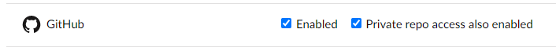

```{r setup, include=FALSE}
knitr::opts_chunk$set(echo = FALSE, message = FALSE, warning = FALSE)
```

## Konton och förberedelse

För att komma åt kursmateriel och lämna in laborationer behöver du konton på GitHub och RStudio Cloud.

- Skapa ett konto på [GitHub](https://github.com/join). I [inställningarna till din profil](https://github.com/settings/profile) anger ditt namn så som det är skrivet i Ladok  (om du av någon anledning inte vill ange ditt fullständiga namn här kontaktar du kursansvarig).

- Skapa därefter ett konto på [RStudio Cloud](https://rstudio.cloud/plans/free) (Cloud Free), välj alternativet **Sign up with GitHub** för att koppla de två plattformarna. Gå till dina [inställningarna för autentisering](https://login.rstudio.cloud/identity/authentication) och kryssa *Private repo access also enabled* som nedan.


- Ange ditt GitHub användarnamn i [formuläret på kursens sida på kurser.math](https://kurser.math.su.se/mod/feedback/view.php?id=64391). Inom några dagar kommer du få ett epost med ämnesrad *[GitHub] @mskoldSU has invited you to join the @MT3003-ST21 organization*. Tacka ja till inbjudan.

- På måndag 7/6 kommer du få epost med inbjudan till kursens arbetsyta på RStudio Cloud, tacka ja till den.

***

## **v23**: Introduktion till kursverktyg

Den första veckan kommer innehålla administration och avslutas med en provkörning av kursverktygen i laboration 1.

#### Mål denna vecka
- Dina kurskonto på [GitHub](https://github.com/)  och [RStudio Cloud](https://rstudio.cloud/) skall vara kopplade till kursens arbetsytor.
- Första laborationen inlämnad. (Deadline söndag).

#### Kursmaterial (prel.)

- Hadley Wickham and Garrett Grolemund, *R for Data Science* (i fortsättningen R4DS): [Kapitel 1, Introduction](https://r4ds.had.co.nz/introduction.html).


***

## **v24**: Enkla visualiseringar och utdrag

#### Mål denna vecka

- Att ha grundläggande förståelse för Rs datatyper.
- Att kunna skapa enkla punktdiagram och förstå de grundläggande komponenterna i en `ggplot`-visualisering (`data`, `mapping`, `geom`).
- Att kunna sortera och filtrera data.


#### Kursmaterial (prel.)

- R4DS: [Kapitel 2-4](https://r4ds.had.co.nz/introduction.html).

RStudio Primers: 

- [The Basics](https://rstudio.cloud/learn/primers/1)
- [Working with tibbles](https://rstudio.cloud/learn/primers/2.1)
- [Isolating data with dplyr](https://rstudio.cloud/learn/primers/2.2)

***

## **v25**: Sammanfatta en tabell


#### Mål denna vecka

- Skapa nya kolumner med `mutate`
- Sammanställningar med `group_by` och `summarise`
- Skriva en enkel rapport i Rmarkdown.

#### Kursmaterial (prel.)

- R4DS: [Kapitel 5-6](https://r4ds.had.co.nz/transform.html).

RStudio Primers:

- [Deriving information with dplyr](https://rstudio.cloud/learn/primers/2.3)


***

## **v26**: Utforska data med visualiseringar

#### Mål denna vecka

- Utforska data med `ggplot`.
- Andra laborationen inlämnad (deadline söndag).

#### Kursmaterial (prel.)

- R4DS: [Kapitel 7](https://r4ds.had.co.nz/exploratory-data-analysis.html).

RStudio Primers:

- [Visualize Data](https://rstudio.cloud/learn/primers/3)

***

## **v27**: Läsa data från fil

#### Mål denna vecka

- Att läsa data från fil

#### Kursmaterial (prel.)

- R4DS: [Kapitel 9-11](https://r4ds.had.co.nz/data-import.html).

***

## **v28**: Omforma och sammanfläta tabeller

***

## **v29**: Arbeta med text

***

## **v30**: Funktioner och iteration

***

## **v31**: APIer, databaser och webbskrap

***

## **v32**: Mer om visualisering

